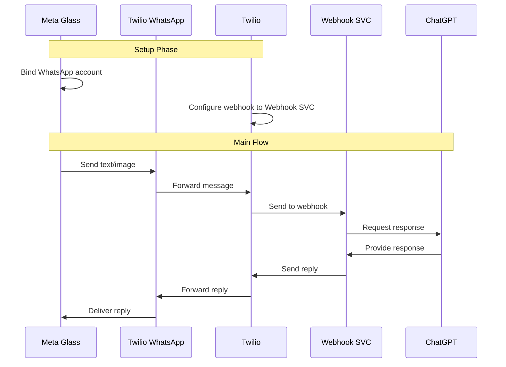

meta-vision-bridge

tldr:



prerequisite:

- whatsapp account
- Twilio account [^1]
- VPS with public IP
- Cloudflare [^2]


steps:

1. register whatsapp account and connected to your meta view app
2. register twilio and bind your whatsapp account from step1: you may need to setup a name for twilio's whatsapp account, for example, myAI
3. setup webhook service for twilio:
    1. `git clone git@github.com:cdpath/meta-vision-bridge.git`
    2. `cd meta-vision-bridge/webhook_svc`
    3. `cp .env.example .env`
    4. **Fill in the required environment in .env**
    5. `docker compose up -d --build` or `docker-compose up -d --build`
    6. set twilio sandbox webhook URL to your webhook service

usage:

for text conversation

```
Hey meta, send a message to myAI, {What is one plus one?}
> send a message to myAI, ready to send?
Send

> One plus one equals two.
```

for image conversation

```
Hey meta, take a photo and send to myAI
> send a photo to myAI, ready to send?
Send

Hey meta, send a message to myAI, {Describe the photo}
> send a message to myAI, ready to send?
Send
> {reply}
```


[^1]: https://docs.dify.ai/zh-hans/learn-more/use-cases/dify-on-whatsapp
[^2]: https://github.com/caddy-dns/cloudflare
