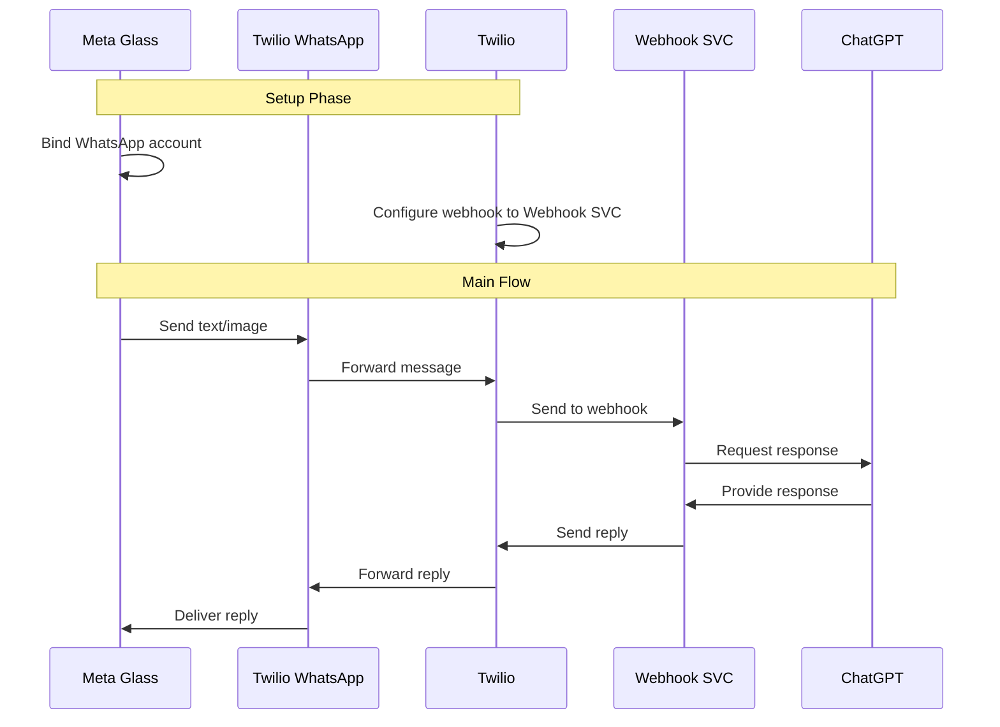

meta-vision-bridge

tldr:

prerequisite:

- whatsapp account
- Twilio account [^1]
- VPS with public IP
- Cloudflare [^2]

[^1]: https://docs.dify.ai/zh-hans/learn-more/use-cases/dify-on-whatsapp
[^2]: https://github.com/caddy-dns/cloudflare
